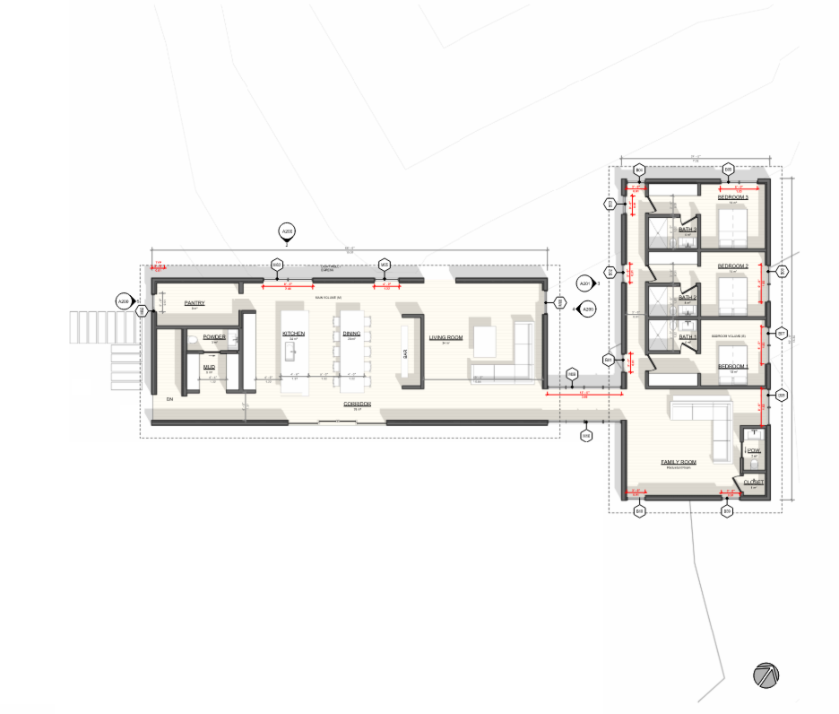
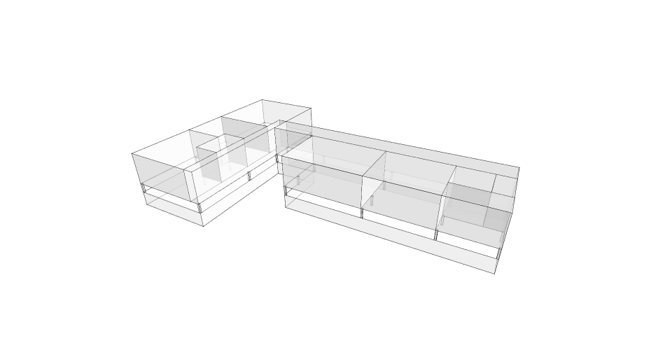
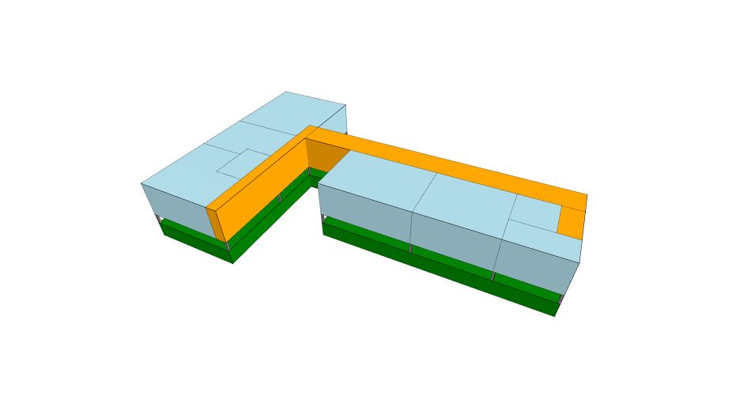

# Homework 03 — Building Graph Representation (BGR)

## Overview

This homework models a building in Rhino, exports it as geometry, converts it into a graph, and uses a pre-trained Graph Machine Learning model to classify the building's relationship to the ground.

---

## Floor Plan



The starting point is a building designed in Rhino. Four layers are exported as separate OBJ files:

| File | Layer Description |
|------|-------------------|
| `ground.obj` | Slab / podium |
| `columns.obj` | Structural columns |
| `offices.obj` | Office volumes |
| `core.obj` | Core + corridors |

---

## 13A — Creating the Building Graph (BGR Graph)

### Step 1 — Import Geometry

Each OBJ file is loaded using `Topology.ByOBJPath`. This produces a list of topology objects per building component.

### Step 2 — Assign Cell Categories

Faces from each component are flattened and merged into a `CellComplex` using `Topology.SelfMerge`. Each resulting cell is tagged with a dictionary containing:

- `cell_type` — integer category (0=ground, 1=column, 3=office, 4=core)
- `cell_name` — human-readable label
- `cell_color` — display color for visualisation

An internal vertex (selector) is placed inside each cell and carries this dictionary.

### Step 3 — Build the CellComplex



All cells from all components are merged into a single `CellComplex` using `Topology.SelfMerge`. This creates a topologically consistent solid model where shared walls between adjacent spaces become internal faces.

### Step 4 — Transfer Dictionaries



The category dictionaries stored on the selectors are transferred onto the cells of the merged model using `Topology.TransferDictionariesBySelectors`. This links each spatial cell to its label (ground, column, office, core) so the graph can carry semantic information.

### Step 5 — Build the Adjacency Graph

`Graph.ByTopology(model)` converts the CellComplex into a graph where:

- **Nodes** = cells (spaces)
- **Edges** = shared faces (adjacency between spaces)

Each node is given a **one-hot encoded feature vector** from its `cell_type`:

```
cell_type 0 (ground)  → [1, 0, 0, 0, 0]
cell_type 1 (column)  → [0, 1, 0, 0, 0]
cell_type 3 (office)  → [0, 0, 0, 1, 0]
cell_type 4 (core)    → [0, 0, 0, 0, 1]
```

Features are stored as `feature_00` … `feature_04` on each vertex dictionary.

### Step 6 — Export to CSV

`Graph.ExportToCSV` writes three files used for model input:

| File | Contents |
|------|----------|
| `graphs.csv` | Graph-level label (manually assigned) |
| `nodes.csv` | Node IDs, features, and labels |
| `edges.csv` | Edge source/destination pairs |

---

## 13B — Predicting the Graph Label

### What the Model Does

A pre-trained **Graph Neural Network** (`bgr_model.pt`) was trained on the Building–Ground Relationship (BGR) dataset. It classifies a building graph into one of five categories:

| Label | Category |
|-------|----------|
| 0 | Separation |
| 1 | Separation with Plinth |
| 2 | Adherence |
| 3 | Adherence with Plinth |
| 4 | Interlock |

### Pipeline

1. **Load dataset** — `PyG.ByCSVPath` reads the three CSV files into a PyTorch Geometric dataset
2. **Load model** — `pyg.LoadModel` loads the pre-trained weights from `bgr_model.pt`
3. **Set split** — The entire dataset is set as the test set (`split=(0.0, 0.0, 1.0)`)
4. **Predict** — `pyg.Predict()` runs inference and returns predicted labels, actual labels, and confidence scores

### Output

The result is a DataFrame comparing:

- The **actual label** (manually assigned in `graphs.csv`)
- The **predicted label** (output from the GNN)
- The **confidence** (maximum probability across all five classes)

The goal is to see whether the pre-trained model agrees with the designer's own assessment of how the building relates to the ground.
